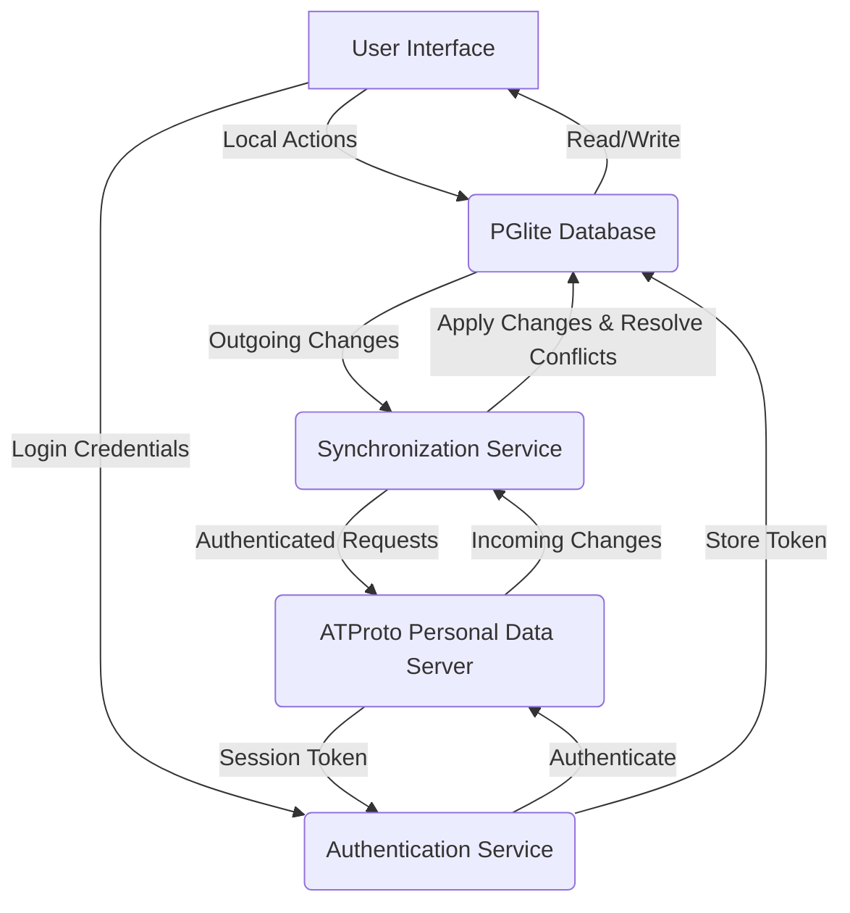

# Architecture Design: Synchronization and Authentication

This document outlines the architectural design for robust data synchronization and secure authentication within the Paper ATProto application. Adhering to high standards of security, privacy, and reliability is paramount for a local-first, decentralized social application.

## 1. Authentication Architecture

### 1.1. Principles

*   **Decentralized Identity**: Leverage ATProto DIDs and handles for user identity, ensuring portability and user control.
*   **Secure Credential Storage**: Store authentication tokens securely using browser-native mechanisms (e.g., IndexedDB with encryption, if available, or `localStorage` with careful consideration of risks).
*   **Resilience**: Implement retry mechanisms with exponential backoff for network-dependent authentication calls.
*   **Privacy**: Minimize data exposure during authentication and ensure user consent for data access.

### 1.2. Flow

1.  **User Login**: The user provides their ATProto handle/DID and password.
2.  **ATProto Agent Authentication**: The application uses the `@atproto/api` `BskyAgent` to authenticate with the user's Personal Data Server (PDS). This typically involves exchanging credentials for a session token.
3.  **Session Management**: The obtained session token (JWT) is securely stored locally. This token will be used for subsequent authenticated requests to the PDS.
4.  **Token Refresh**: Implement a mechanism to refresh session tokens before they expire to maintain continuous user sessions without re-authentication.
5.  **Error Handling**: Implement comprehensive error handling for network issues, invalid credentials, and other authentication failures, providing clear feedback to the user.

### 1.3. Security Considerations

*   **HTTPS Everywhere**: All communication with PDS must occur over HTTPS.
*   **Credential Hashing**: Passwords should never be stored or transmitted in plain text. ATProto handles password hashing on the PDS side.
*   **Token Invalidation**: Implement mechanisms for users to revoke sessions or change passwords, invalidating old tokens.
*   **Cross-Site Scripting (XSS) Protection**: Ensure proper input sanitization and output encoding to prevent XSS vulnerabilities, especially when displaying user-generated content.
*   **Cross-Site Request Forgery (CSRF) Protection**: While less critical for a purely client-side application interacting with an API, ensure that any server-side components (if introduced later) are protected against CSRF.

## 2. Synchronization Architecture

### 2.1. Principles

*   **Local-First**: Prioritize local data access and modifications. All operations should ideally succeed locally first, then synchronize with the PDS.
*   **Eventual Consistency**: Data will eventually be consistent across all user devices and the PDS.
*   **Conflict Resolution**: Implement strategies to handle conflicts that arise when the same data is modified concurrently offline and online, or on multiple devices.
*   **Efficiency**: Optimize data transfer to minimize bandwidth usage and latency.
*   **Privacy**: Only synchronize data that the user explicitly consents to share or that is necessary for the application's core functionality.

### 2.2. Flow

1.  **Initial Sync**: Upon successful authentication, the application performs an initial synchronization to fetch the user's entire data repository from their PDS. This data is stored in the local PGlite database.
2.  **Delta Sync**: After the initial sync, the application will periodically or reactively fetch only changes (deltas) from the PDS. ATProto's Merkle Search Tree (MST) structure facilitates efficient delta synchronization by allowing clients to verify and apply changes based on root hashes.
3.  **Local Writes**: User actions (e.g., creating a post, liking, following) are first applied to the local PGlite database, providing immediate UI feedback.
4.  **Outgoing Sync**: Local changes are then queued and pushed to the user's PDS. This process should be resilient to network failures, using exponential backoff for retries.
5.  **Conflict Resolution**: When a conflict is detected (e.g., a local change conflicts with a PDS change), the application will apply a predefined resolution strategy (e.g., last-write-wins, user-prompted resolution, or a more sophisticated merge algorithm).
6.  **Data Sanitation**: All incoming and outgoing data will be sanitized to prevent injection attacks and ensure data integrity.

### 2.3. Data Flow Diagram

## 3. Best Practices for Implementation

*   **Error Handling**: Implement centralized error handling with logging and user-friendly messages. Use `try-catch` blocks for asynchronous operations.
*   **Exponential Backoff**: For network requests (authentication, synchronization), implement exponential backoff with jitter to prevent overwhelming the server and to gracefully handle transient network issues.
*   **Input Validation & Sanitation**: Strictly validate and sanitize all user inputs and data received from external sources to prevent security vulnerabilities (e.g., SQL injection, XSS).
*   **Privacy by Design**: Ensure that user data is handled with privacy in mind at every stage, from storage to transmission and display. Implement data minimization principles.
*   **Security Audits**: Regularly review code for security vulnerabilities and keep dependencies updated.
*   **Offline-First Development**: Design components to function seamlessly offline, with clear indicators for synchronization status.

## References

*   [1] [AT Protocol Documentation](https://atproto.com/docs) - Official documentation for the Authenticated Transfer Protocol.
*   [2] [PGlite Documentation](https://pglite.dev/docs) - Documentation for PGlite, Postgres in WASM.
*   [3] [Konsta UI Documentation](https://konstaui.com/docs/) - Documentation for Konsta UI, a React UI library for iOS & Material Design.
*   [4] [Xenova/transformers.js](https://huggingface.co/Xenova/all-MiniLM-L6-v2) - Pre-trained model for feature extraction in Transformers.js.
